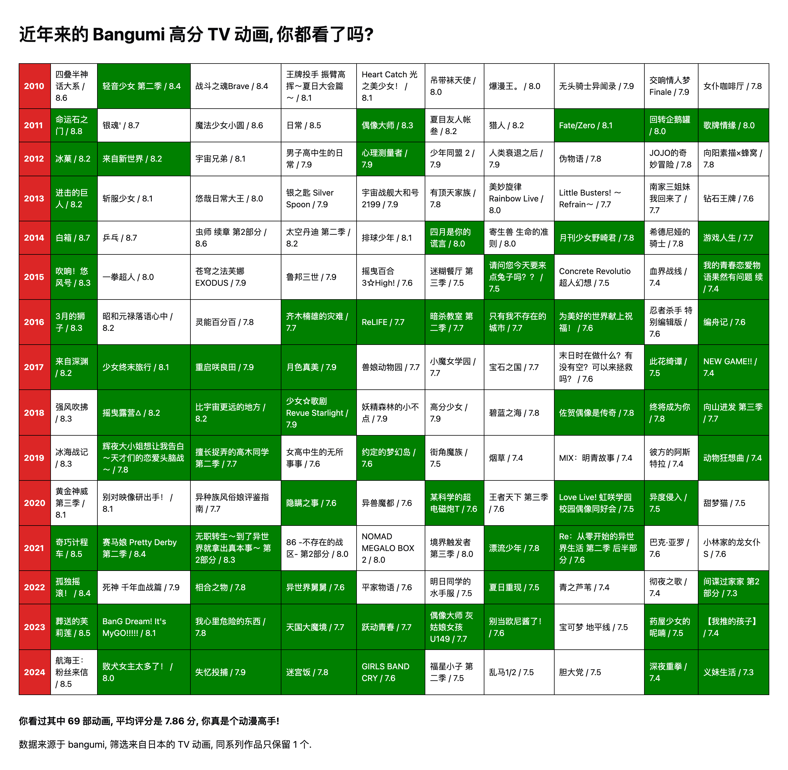

# BingoLands 宾果群岛

[](https://t.me/bingolands)
[](https://github.com/yjl9903/BingoLands/actions/workflows/ci.yml)

生成可分享可交互的 Bingo! 游戏！ → [BingoLands](https://bingo.animes.garden/)



## 如何配置 Bingo?

> 可视化编辑器 work in progress, 目前你可以把以下代码丢给 AI 来生成（x

- **类型定义**: [input/types.ts](./packages/bingolands/src/input/types.ts), [types.ts](./packages/bingolands/src/types.ts)
- **数据结构示例**: [assets/anime-data.json](./assets/anime-data.json), [assets/anime-data.yaml](./assets/anime-data.yaml)
- **合成表格示例**: [examples/bangumi-top.ts](./examples/bangumi-top.ts), [examples/generate-bingo.ts](./examples/generate-bingo.ts)

## 使用 bingolands 包

```bash
npm i bingolands
```

你可以参考 [examples/bangumi-top.ts](./examples/bangumi-top.ts) 和 [examples/generate-bingo.ts](./examples/generate-bingo.ts) 编写脚本, 生成自己的 `BingoContent`, 上传到网站上分享.

## 鸣谢

- [动画世代](https://github.com/egoist/anime-sedai)
- [Bangumi 番组计划](https://bgm.tv/)

## 开源协议

AGPL-3.0 License © 2025 [XLor](https://github.com/yjl9903)
